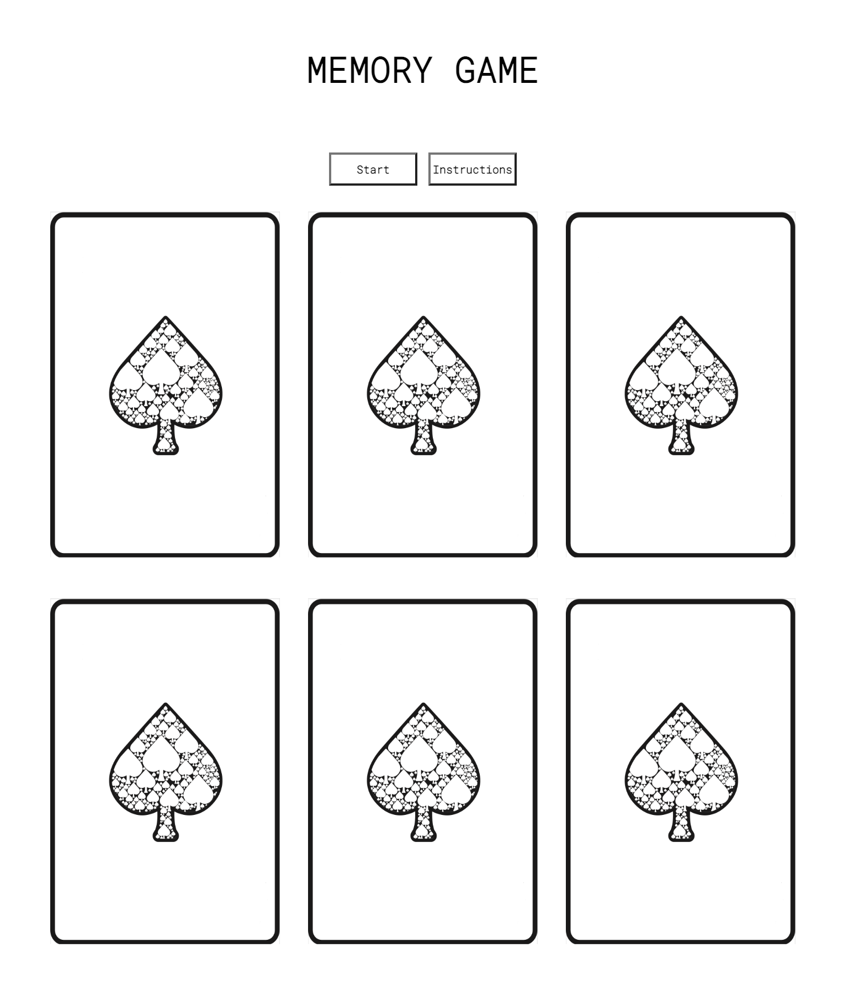

# MemoryCardGame

##WireFrame

## Preview 
This game is a memory card game with a very simple black and white theme, to throw the player off.

## Deployed site :
https://wondrous-bubblegum-f75309.netlify.app/

## Technology used :

Javascript, CSS, and HTML. Images and fonts were used.
---
## Approach:
My main approach was using the images to know what card was being clicked by giving them a dataset attribute in the HTML. I also kept track of how which card was the second and first choice by giving each of those clicks a variable.

# How I solved for the winner:
I set a clicks variable that tracks how many cards were clicked and flipped. If you went over that number of clicks you lose.

## User Stories
As a user, I would like to be able to see the cards before they are flipped and be able to click the specific card I want to uncover. When I uncover the cards I would want the card to remain uncovered until I pick my second card. If I fail to get a matching value of cards then GAME OVER. If complete the set given to me I would like a couple more cards added to the game field.

## What's left?
Adding more levels, with some sounds, and some card flipping animation.

